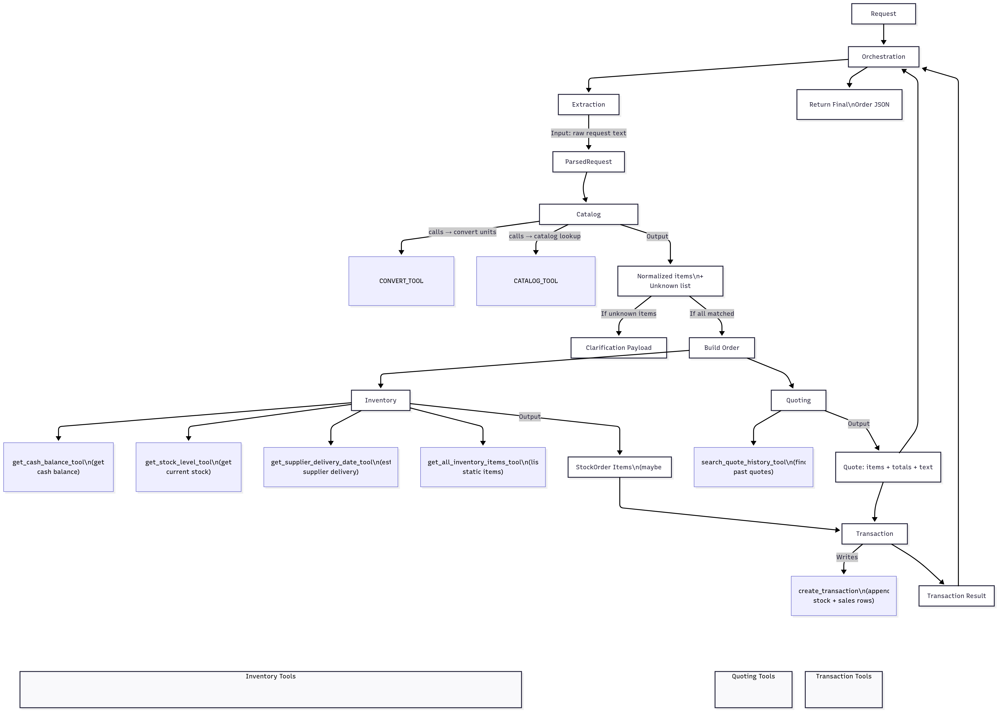

🦫 BeaverChoice – Multi-Agent Order Processing System
📖 Project Overview

BeaverChoice is a multi-agent order processing system that simulates real-world workflows for handling customer requests. It leverages a modular agent-based architecture to process orders from request to transaction, ensuring scalability, maintainability, and extensibility.

🧩 Agents in the System

Extraction Agent – Parses raw customer requests.

Catalog Matcher – Maps parsed items to known catalog entries.

Inventory Agent – Checks stock availability and supplier delivery.

Quoting Agent – Calculates prices, discounts, and totals.

Transaction Agent – Finalizes successful orders and updates cash/inventory.

🎯 Objectives

Automate customer order handling.

Validate catalog items, stock, and delivery feasibility.

Apply business logic (discounts, loyalty rewards).

Provide clarifications when orders are ambiguous.

Demonstrate the multi-agent system design pattern.

⚙️ Setup Instructions
1. Clone Repository
git clone https://github.com/AmrShams9/Beaver-s-Choice_Multi-Agent-System.git
cd Beaver-s-Choice_Multi-Agent-System

2. Install Dependencies
pip install -r requirements.txt

3. Environment Variables

Create a .env file and add your keys:

OPENAI_API_KEY=your_api_key_here

4. Run the System
python main.py

🚀 Usage Guidelines

Enter a customer request (e.g., “I need 50 sheets of heavy cardstock”).

The agents will process the request step by step.

The system returns one of:

✅ Successful order confirmation

⚠️ Clarification request

❌ Error message (stock/delivery issue)

🏗️ System Architecture

The workflow is illustrated below:

Flow Explanation:

Request → Orchestration Agent – Starts the pipeline.

Extraction Agent – Converts text into structured JSON (ParsedRequest).

Catalog Matcher – Normalizes items against the catalog.

Inventory Agent – Validates stock & supplier delivery.

Quoting Agent – Applies discounts, prepares order summary.

Transaction Agent – Finalizes transactions or raises errors.

🧪 Testing & Results

The system was tested with 20+ customer requests:

Request IDs	Outcome	Notes
4, 6, 7, 8, 10–12	✅ Successful Orders	Discounts applied, inventory/cash updated.
1, 2, 5, 14, 15,20	⚠️ Clarification Needed	Ambiguous items (e.g., “heavy cardstock”) triggered suggestions.
3, 9, 13, 16–19	❌ Ordering Errors	Insufficient stock or delivery conflicts. No fallback suggestions.
✅ Submission Checklist

 Code documented with inline comments and docstrings.

 README with project overview, setup, usage, and architecture.

 Workflow diagram (beaverChoice.png).

 Test results documented.

 Reflection Report included.

✨ Section 6: Reflection Report
🧪 Test Results Reflection

Reliable for straightforward orders.

Ambiguous terms often required clarifications.

Stock/delivery validation accurate but lacked fallback handling.

🏗️ Architectural Decisions

Modular agent pipeline (Extraction → Catalog → Inventory → Quoting → Transaction).

Trade-off: Limited to 5 agents → simplicity vs. specialization.

Centralized catalog normalization.

Strong delivery & stock validation rules.

💡 Improvement Suggestions

Expand synonym dictionary to reduce clarifications.

Add fallback handling (smaller quantities, substitutions).

Support dynamic pricing (loyalty, seasonal promos).

Upgrade to production-grade DB for scalability.

Integrate customer feedback loop for clarifications.

⚖️ Strengths & Weaknesses

Strengths:
✔ Modular, extensible design
✔ Smooth integration of quoting & transaction logic
✔ Strong clarification mechanism
✔ Discounts & financial updates applied consistently

Weaknesses:
✘ High reliance on clarifications
✘ No fallback handling for failed orders
✘ Strict delivery checks (no partial fulfillment)
✘ Scalability limits for large catalogs

📌 Conclusion

BeaverChoice demonstrates a functional, modular, and extensible multi-agent architecture for order processing. It successfully simulates real workflows but needs enhancements in catalog matching, fallback handling, and scalability to reach production-grade robustness.
